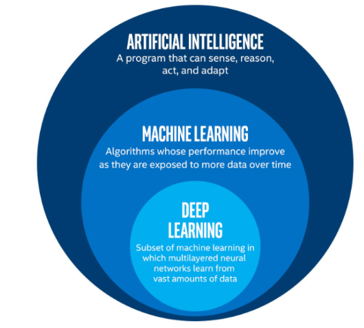
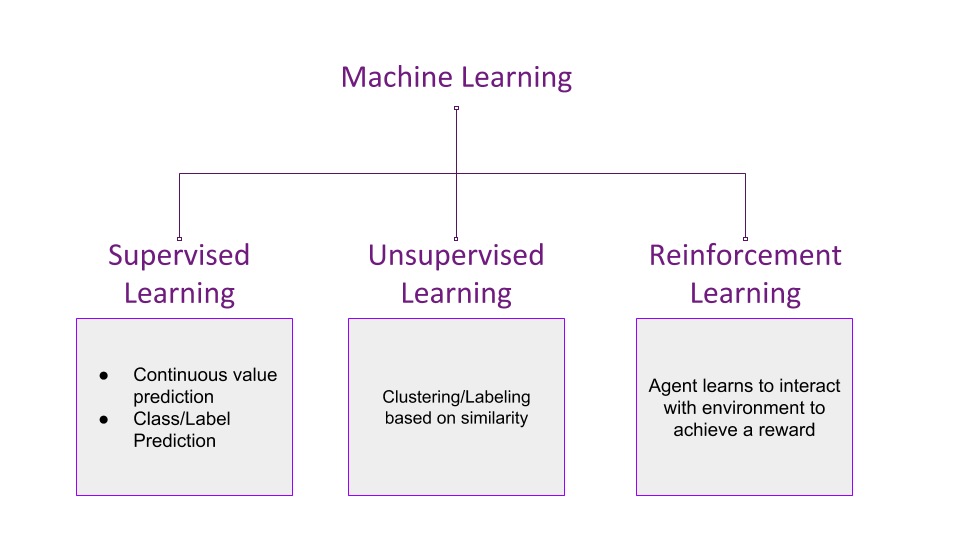

## AI

An AI is a system that typically demonstrate at least some of the following behaviours associated with human intelligence: planning, learning, reasoning, problem solving, knowledge representation, perception, motion, and manipulation and, to a lesser extent, social intelligence and creativity.

## Machine Learning

Machine learning is a subset of AI. It is an approach to try achieve AI through systems that can find patterns in a set of data. “Machine learning can be described as the science of getting computers to act without being explicitly programmed” - Stanford University.

## Deep Learning

One of the techniques for implementing machine learning. Deep Learning is inspired by the structure of a human brain. Deep learning algorithms attempt to draw similar conclusions as humans would by continually analyzing data with a given logical structure. To achieve this, deep learning uses a multi-layered structure of algorithms called neural networks.

## Data Science

Analyzing data, looking at data and then doing something with it, for usually some sort of business goal.

## Types of machine learning.

- **Supervised learning**  
  Supervised Learning is the one, where you can consider the learning is guided by a teacher. We have a dataset which acts as a teacher and its role is to train the model or the machine. Once the model gets trained it can start making a prediction or decision when new data is given to it.

- **Unsupervised learning**  
  The model learns through observation and finds structures in the data. Once the model is given a dataset, it automatically finds patterns and relationships in the dataset by creating clusters in it. What it cannot do is add labels to the cluster, like it cannot say this a group of apples or mangoes, but it will separate all the apples from mangoes.

  Suppose we presented images of apples, bananas and mangoes to the model, so what it does, based on some patterns and relationships it creates clusters and divides the dataset into those clusters. Now if a new data is fed to the model, it adds it to one of the created clusters.

- **Reinforcement Learning**:  
  It is the ability of an agent to interact with the environment and find out what is the best outcome. It follows the concept of hit and trial method. The agent is rewarded or penalized with a point for a correct or a wrong answer, and on the basis of the positive reward points gained the model trains itself. And again once trained it gets ready to predict the new data presented to it.

---

Beyond Python there are a number of open source libraries generally used to facilitate practical machine learning.

### Matplotlib

Matplotlib is a Python 2D plotting library which produces publication quality figures in a variety of hardcopy formats and interactive environments across platforms. Matplotlib can be used in Python scripts, the Python and IPython shell, the jupyter notebook, web application servers, and four graphical user interface toolkits.

### NumPy

NumPy is the fundamental package for scientific computing in Python. It is a Python library that provides a multidimensional array object, various derived objects (such as masked arrays and matrices), and an assortment of routines for fast operations on arrays, including mathematical, logical, shape manipulation, sorting, selecting, I/O, discrete Fourier transforms, basic linear algebra, basic statistical operations, random simulation and much more.

### Tensorflow

TensorFlow: TensorFlow is an open source software library for numerical computation using data flow graphs. Nodes in the graph represent mathematical operations, while the graph edges represent the multidimensional data arrays (tensors) communicated between them.

### Pandas

Pandas: Pandas is an open source, BSD-licensed library providing high-performance, easy-to-use data structures and data analysis tools for the Python programming language.
